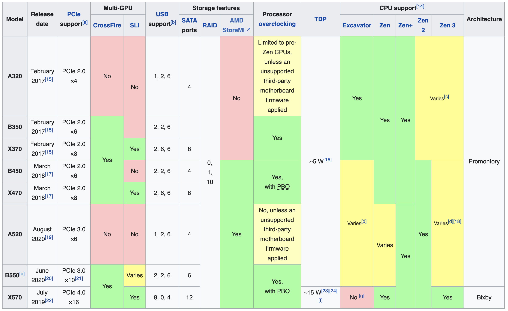

# HTML table data extractor for Go

[](https://pkg.go.dev/mod/github.com/nfx/go-htmltable)
[](https://github.com/nfx/go-htmltable/blob/main/LICENSE)
[](https://codecov.io/gh/nfx/go-htmltable)
[](https://github.com/nfx/go-htmltable/actions?query=workflow%3Abuild+branch%3Amain)


`htmltable` enables structured data extraction from HTML tables and URLs and requires almost no external dependencies. Tested with Go 1.18.x and 1.19.x.

## Installation

```bash
go get github.com/nfx/go-htmltable
```

## Usage

You can retrieve a slice of `header`-annotated types using the `NewSlice*` contructors:

```go
type Ticker struct {
    Symbol   string `header:"Symbol"`
    Security string `header:"Security"`
    CIK      string `header:"CIK"`
}

url := "https://en.wikipedia.org/wiki/List_of_S%26P_500_companies"
out, _ := htmltable.NewSliceFromURL[Ticker](url)
fmt.Println(out[0].Symbol)
fmt.Println(out[0].Security)

// Output: 
// MMM
// 3M
```

An error would be thrown if there's no matching page with the specified columns:

```go
page, _ := htmltable.NewFromURL("https://en.wikipedia.org/wiki/List_of_S%26P_500_companies")
_, err := page.FindWithColumns("invalid", "column", "names")
fmt.Println(err)

// Output: 
// cannot find table with columns: invalid, column, names
```

And you can use more low-level API to work with extracted data:

```go
page, _ := htmltable.NewFromString(`<body>
    <h1>foo</h2>
    <table>
        <tr><td>a</td><td>b</td></tr>
        <tr><td> 1 </td><td>2</td></tr>
        <tr><td>3  </td><td>4   </td></tr>
    </table>
    <h1>bar</h2>
    <table>
        <tr><th>b</th><th>c</th><th>d</th></tr>
        <tr><td>1</td><td>2</td><td>5</td></tr>
        <tr><td>3</td><td>4</td><td>6</td></tr>
    </table>
</body>`)

fmt.Printf("found %d tables\n", page.Len())
_ = page.Each2("c", "d", func(c, d string) error {
    fmt.Printf("c:%s d:%s\n", c, d)
    return nil
})

// Output: 
// found 2 tables
// c:2 d:5
// c:4 d:6
```

Complex [tables with row and col spans](https://en.wikipedia.org/wiki/List_of_AMD_chipsets#AM4_chipsets) are natively supported as well. You can annotate `string`, `int`, and `bool` fields. Any `bool` field value is `true` if it is equal in lowercase to one of `yes`, `y`, `true`, `t`.



```go
type AM4 struct {
    Model             string `header:"Model"`
    ReleaseDate       string `header:"Release date"`
    PCIeSupport       string `header:"PCIesupport[a]"`
    MultiGpuCrossFire bool   `header:"Multi-GPU CrossFire"`
    MultiGpuSLI       bool   `header:"Multi-GPU SLI"`
    USBSupport        string `header:"USBsupport[b]"`
    SATAPorts         int    `header:"Storage features SATAports"`
    RAID              string `header:"Storage features RAID"`
    AMDStoreMI        bool   `header:"Storage features AMD StoreMI"`
    Overclocking      string `header:"Processoroverclocking"`
    TDP               string `header:"TDP"`
    SupportExcavator  string `header:"CPU support[14] Excavator"`
    SupportZen        string `header:"CPU support[14] Zen"`
    SupportZenPlus    string `header:"CPU support[14] Zen+"`
    SupportZen2       string `header:"CPU support[14] Zen 2"`
    SupportZen3       string `header:"CPU support[14] Zen 3"`
    Architecture      string `header:"Architecture"`
}
am4Chipsets, _ := htmltable.NewSliceFromURL[AM4]("https://en.wikipedia.org/wiki/List_of_AMD_chipsets")
fmt.Println(am4Chipsets[2].Model)
fmt.Println(am4Chipsets[2].SupportZen2)

// Output:
// X370
// Varies[c]
```

And the last note: you're encouraged to plug your own structured logger:

```go
htmltable.Logger = func(_ context.Context, msg string, fields ...any) {
    fmt.Printf("[INFO] %s %v\n", msg, fields)
}
htmltable.NewFromURL("https://en.wikipedia.org/wiki/List_of_S%26P_500_companies")

// Output:
// [INFO] found table [columns [Symbol Security SEC filings GICSSector GICS Sub-Industry Headquarters Location Date first added CIK Founded] count 504]
// [INFO] found table [columns [Date Added Ticker Added Security Removed Ticker Removed Security Reason] count 308]
```

## Inspiration

This library aims to be something like [pandas.read_html](https://pandas.pydata.org/docs/reference/api/pandas.read_html.html) or [table_extract](https://docs.rs/table-extract/latest/table_extract/) Rust crate, but more idiomatic for Go.